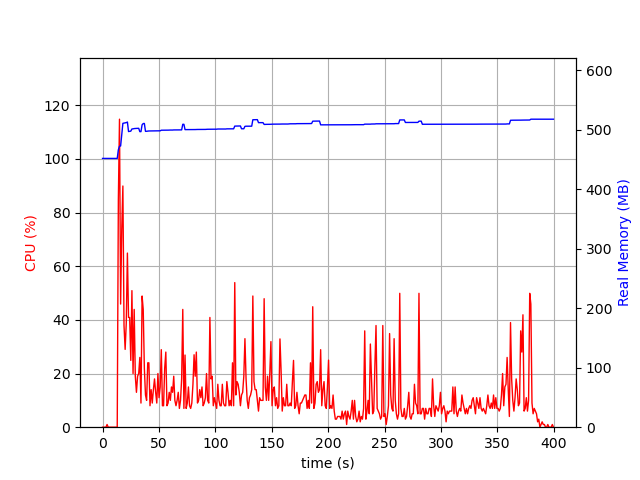

= Comparação Geração de Imagens Nativas

Uma breve comparação sobre o processo de geração e execução das imagens nativas geradas com a mesma implementação com Spring Boot, Micronaut e Quarkus. Os testes foram executados na máquina:

image::img/system.png[]

== Ranking

[cols="^,^,^,^", options="header"]
|===
||Spring Boot|Micronaut|Quarkus 
|Facilidade de Geração|:3rd_place_medal:|:2nd_place_medal:|:1st_place_medal:
|Tamanho da Imagem|:3rd_place_medal:|:2nd_place_medal:|:1st_place_medal:
|Tempo de Subida|:3rd_place_medal:|:2nd_place_medal:|:1st_place_medal:
|Execuções Necessárias|:2nd_place_medal:|:3rd_place_medal:|:1st_place_medal:
|Tempo de Subida Padrão|:3rd_place_medal:|:2nd_place_medal:|:1st_place_medal:
|===

== Benchmark

Em breve

== Spring Boot

=== Processos

- (:-1:) Foi necessário executar o https://docs.oracle.com/en/graalvm/enterprise/19/guide/reference/native-image/tracing-agent.html#:~:text=The%20tracing%20agent%20was%20implemented,VM%20Tool%20Interface%20(JVMTI)[Tracing Agent do GraalVM] manualmente, para gerar os arquivos necessários para a construção da imagem.
- (:-1:) Consumo de memória alto, sendo necessário finalizar processos e recomeçar a construção mais de uma vez por estouro de memória.
- (:-1:) Obrigatoriedade de usar Maven para execução do processo.
- (:-1:) Durante o processo, foi recebida a informação sobre a inicialização indevida da classe `sun.instrument.InstrumentationImpl`. Para correção do parâmetro adequadamente, foi necessário realizar o processo mais duas vezes.
- (:+1:) Funcionou adequadamente com a última versão conforme processo da documentação oficial.

[cols="^,^", options="header"]
|===
2+|Spring Boot
|Tamanho da Imagem|184,9 MB
|Tempo de Subida|130ms
|Quantidade de Execuções para Gerar a Imagem|4
|Tempo de Subida Padrão|4.263s
|===

== Micronaut

=== Processos

- (:+1:) Gerou as configurações necessárias de maneira automática.
- (:-1:) Consumo de memória alto, sendo necessário finalizar processos e recomeçar a construção mais de uma vez por estouro de memória.
- (:+1:) Maven e Gradle disponíveis.
- (:-1:) Durante o processo, foi recebida a informação sobre a inicialização indevida da classe `kotlin.ULong`. Não houve sucesso nas tentativas de resolver o problema através de configuração.
- (:-1:) Foi necessário fazer downgrade da versão do Micronaut, que deixou de trazer a versão da dependência do `Jackson Data Processor` que fazia uso da classe `kotlin.ULong`.

[cols="^,^", options="header"]
|===
2+|Micronaut
|Tamanho da Imagem|103,9 MB
|Tempo de Subida|62ms
|Quantidade de Execuções para Gerar a Imagem|5
|Tempo de Subida Padrão|1.516s
|===

== Quarkus

=== Processos

- (:+1:) Gerou as configurações necessárias de maneira automática.
- (:+1:) Consumo de memória ainda alto, mas não houve estouro de memória mesmo sem a finalização de processos abertos.
- (:+1:) Maven e Gradle disponíveis.
- (:+1:) Funcionou adequadamente com a última versão conforme processo da documentação oficial e sem configurações adicionais.

[cols="^,^", options="header"]
|===
2+|Quarkus
|Tamanho da Imagem|61,5 MB
|Tempo de Subida|15ms
|Quantidade de Execuções para Gerar a Imagem|1
|Tempo de Subida Padrão|1.405s
|===

== Resultado Final

[cols="^,^,^,^", options="header"]
|===
||Spring|Micronaut|Quarkus
|Tamanho da Imagem|184,9 MB|103,9 MB|61,5 MB
|Tempo de Subida|130ms|62ms|15ms
|Quantidade de Execuções para Gerar a Imagem|4|5|1
|Tempo de Subida Padrão|4.263s|1.516s|1.405s
|===

== Execução

image::img/execucao.png[]

== Comparações da Execução Padrão

=== Tempo de Build Padrão

Utilizando o https://github.com/gradle/gradle-profiler[gradle-profiler]

[cols="^,^,^", options="header"]
|===
|Spring|Micronaut|Quarkus
|1.334,76 ms|586,10 ms|2.403,78 ms
|===

=== Testes de Carga

==== Carga Baixa

Utilização do Gatling com a seguinte configuração:
[source,scala]
----
  setUp(
    scn.inject(
      nothingFor(1),
      atOnceUsers(10),
      rampUsers(10).during(1),
      constantUsersPerSec(20).during(5),
      constantUsersPerSec(20).during(5).randomized,
      rampUsersPerSec(10).to(20).during(3.minutes),
      rampUsersPerSec(10).to(20).during(3.minutes).randomized
    ).protocols(httpProtocol)
  )
----

[cols="^,^,^,^", options="header"]
|===
||Spring|Micronaut|Quarkus
|Número de Requisições pelo Tempo do Teste|5648|5634|5616
|Tempo Máximo de Resposta|524ms|2838ms|475ms
|Tempo de Resposta Padrão|4ms|15ms|3ms
|Porcentagem das Requisições no Tempo Padrão|81,58%|98,89%|71,61%

|===

===== Uso de Memória e CPU durante os testes de Carga Baixa

Utilização do `psrecord` para coleta de uso de memória e CPU do processo.

- Spring

- Micronaut

- Quarkus

